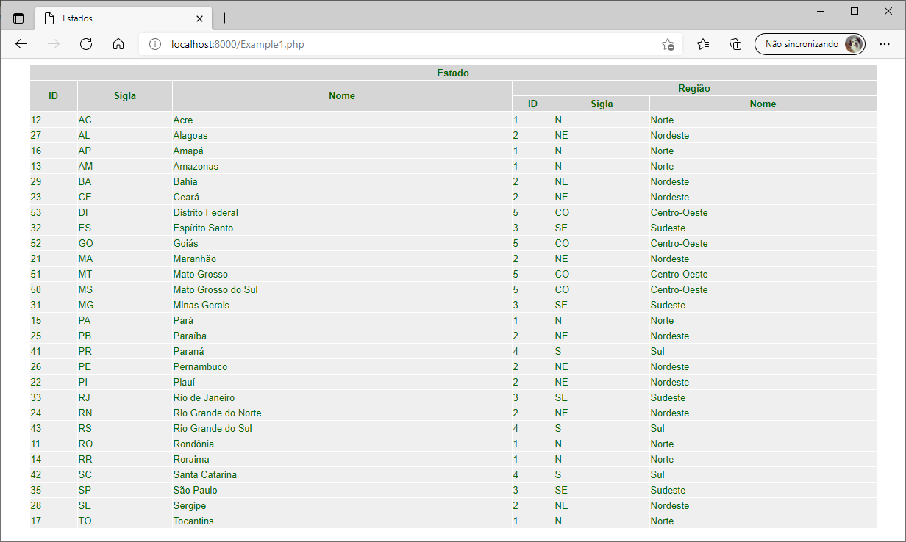
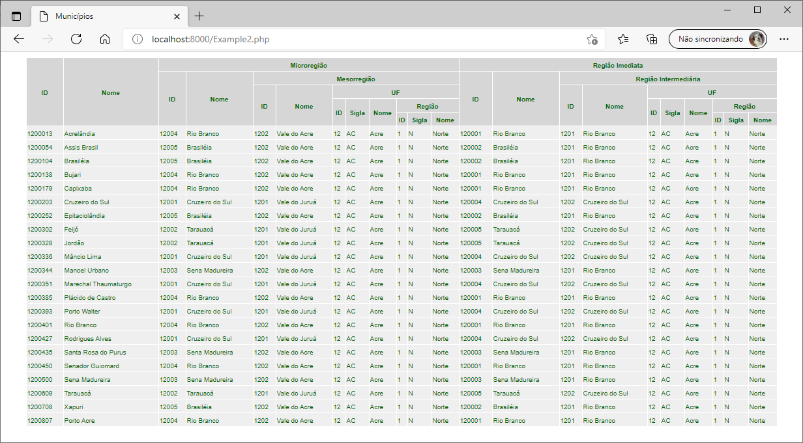

 

# LocalidadeX

Biblioteca para busca (_on-line_) e listagem de estados e seus respectivos municípios, efetua a consulta via API do [IBGE](https://servicodados.ibge.gov.br/api/docs/localidades), disponibilizando os dados para, por exemplo, preenchimento de um formulário.

## Install

**Método 1**. Adicione ao arquivo **composer.json** o trecho abaixo, após isso execute o **install** ou **update** do composer.
```bash
"require": {
        "emso-exe/localidadex": "dev-main"
    }
```

**Método 2**. No diretório do seu projeto execute o comando abaixo, será atualizado o arquivo **composer.json**.
```bash 
composer require emso-exe/localidadex 
```

**Método 3**. No diretório do seu projeto execute o comando abaixo, será necessário que faça modificações no seu projeto.
```bash
git clone https://github.com/emso-exe/LocalidadeX.git
```

## Tecnologias

- PHP

## Teste

**Método**. Com o servidor web, por exemplo do PHP, ativado.
```php
http://localhost:8000/Example1.php
http://localhost:8000/Example2.php
```

## Example1.php em execução

**1**. Para listagem de estados não é necessário a passagem de parâmetro.

 

## Example2.php em execução

**2**. Para listagem de municípios é necessário a passagem de parâmetro, o ID do estado definido pela API.

 

## Créditos

- [Estênio Mariano](https://github.com/emso-exe)

## Licença

Licença MIT (MIT). Por favor leia o [arquivo da licença](LICENSE.md) para mais informações.
